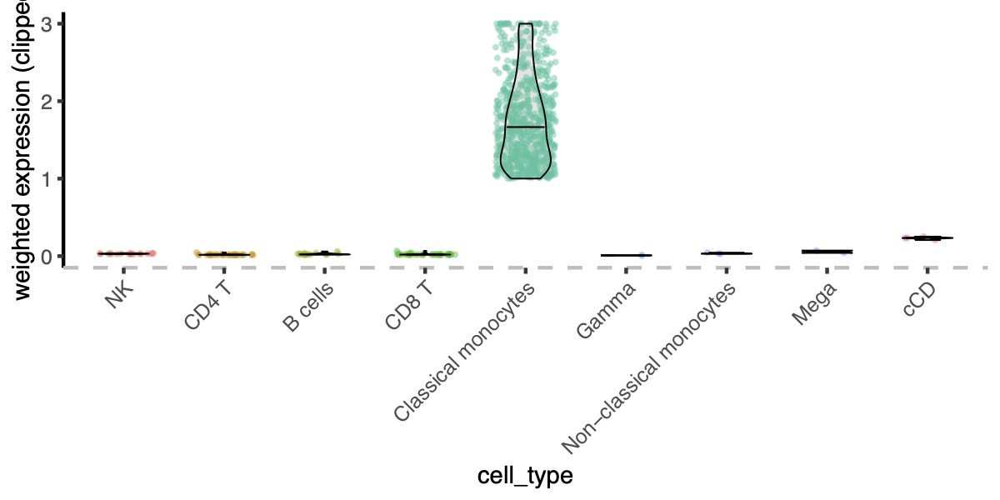

## Vioplot.R

### Usage

```bash
#用 cell_type 作 cluster
Rscript run_weighted_vln_celltype.R \
  --rds Seurat_pmbc.rds \
  --genes genes.tsv \
  --group_by cell_type \
  --outdir vln_celltype \
  --ymax 3 \
  --min_expr 1 \
  --width 4 \
  --height 2
#自定义 cell_type 顺序
Rscript run_weighted_vln_celltype.R \
  --rds Seurat_pmbc.rds \
  --genes genes.tsv \
  --group_by cell_type \
  --cluster_order "B cells,CD8 T,MAIT cells,Classical monocytes,Non-classical monocytes" \
  --outdir vln_celltype
```


